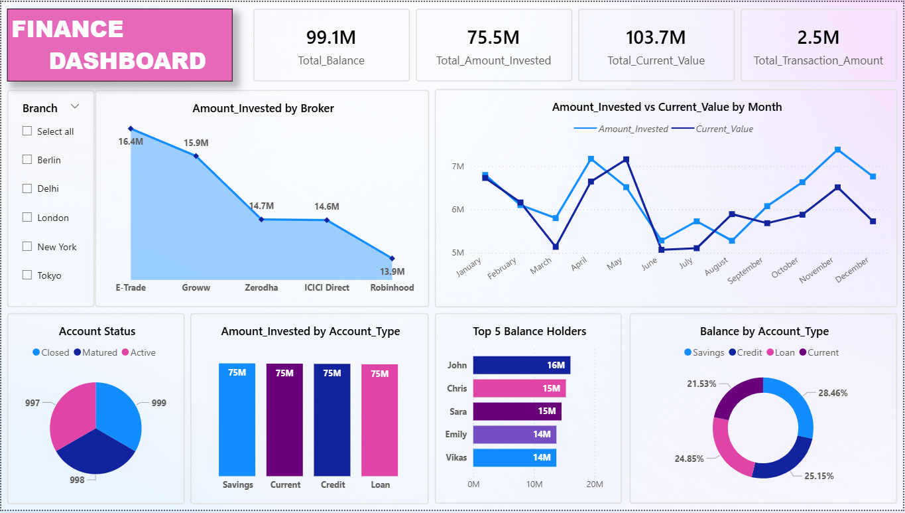

# Finance Dashboard (Power BI)

## Overview
An interactive Power BI dashboard to monitor financial performance across brokers, account types, and monthly trends. Includes key performance indicators like total balance, invested amount, current value, and transaction totals.

## Tools
- Power BI Desktop
- DAX measures
- Slicers for branch filtering

## Dashboard Highlights
- **KPIs:** Total Balance, Total Invested, Current Value, Transaction Amount  
- **Broker Analysis:** Investment distribution across brokers  
- **Time Trends:** Monthly comparison of invested vs current value  
- **Account Views:** Visuals for account statuses and types  
- **Top Holders:** Bar chart of highest balance holders

## How to Run
1. Download `Finance_Dashboard.pbix`  
2. Open in **Power BI Desktop**
3. Explore the visuals and filters

### 🖼️ Dashboard Preview

### 📂 Files
- [Download Power BI File (.pbix)](https://github.com/HackToolsYT/powerbi-finance-dashboard/raw/main/finance_dashboard.pbix)
  
## Contact
[LinkedIn Profile](https://www.linkedin.com/in/vikas-girigoswami-122372201)
